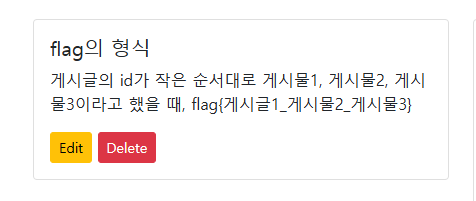
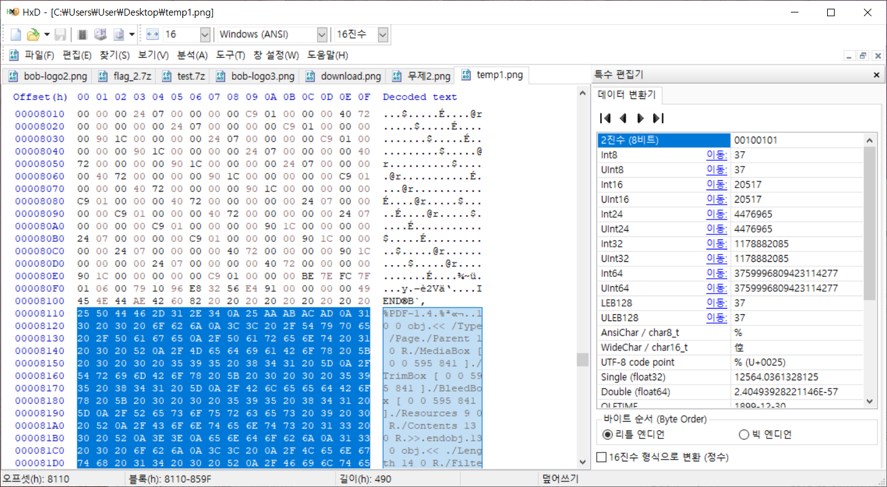
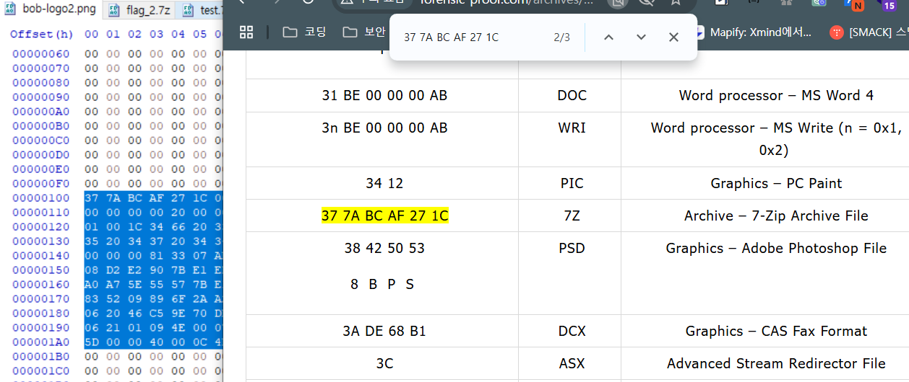
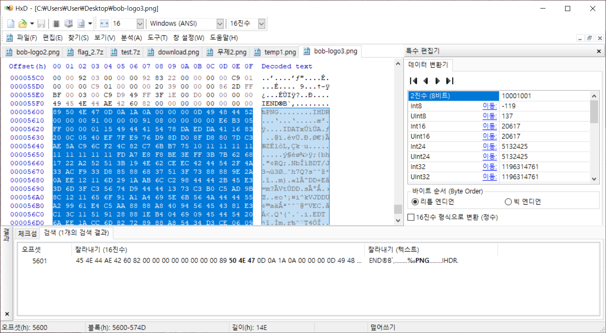

# CTF Project

CTF Projet


## Quick Start
If you have docker compose installed
```sh
docker compose up -d
```

If only docker is installed
```sh
docker build -t ctf_back .
docker run --env-file .env -p 8000:8000 ctf_back
```

## requirements

if you don't have a miniconda(or anaconda), you can install it on this url.
https://docs.anaconda.com/free/miniconda/index.html

```sh
conda create -n secure_coding python=3.9
conda activate secure_coding
pip install -r requirements.txt
```

or

```sh
python3 -m venv .env
source .env/bin/activate
pip install -r requirements.txt
```

## Run


```sh
uvicorn fastapi_app:app --reload
```

or 

```sh
python fastapi_app.py
```


## Structure
```sh
CTF Projet
├── readme.md
├── requirements.txt
├── dockerfile
├── docker-compose.yml
├── main.py
├── ctf.db
├── core
│   └── config.py
├── database
│   ├── database.py
│   └── models.py
├── service
│   ├── __init__.py
│   ├── auth
│   │   ├── auth_crud.py
│   │   ├── auth_route.py
│   │   └── auth_schema.py
│   ├── note
│   │   ├── note_crud.py
│   │   ├── note_route.py
│   │   └── note_schema.py
│   └── user
│       ├── user_crud.py
│       ├── user_route.py
│       └── user_schema.py
└── utils
    ├── oauth.py
    └── passHash.py

```

- `readme.md`: It contains information about the project and how to implement it.
- `requirements.txt`: A file for managing the project's dependencies.
- `dockerfile`: This is a file for running the project in a Docker environment.
- `docker-compose.yml`: This file exists for execution via docker compose.
- `main.py`: This is the file to run the project.
- `ctf.db`: This is the file where information related to the project is stored.
- `core`: There are files related to project settings.
- `database`: There are files related to the settings of the database.
- `service`: There are documents related to the service API.
    - `*_crud.py`: These are documents related to database operations.
    - `*_schema.py`: Defines the input and output format of the API.
    - `*_route.py`: There are endpoints and implementations of the API.
- `utils`:  There are other things that are required to implement the project.


<details>
<summary>풀이</summary>









**정답**
- flag{iYXrfKpgER_O0xueGD6aT_9bzw6lckgn}

</details>